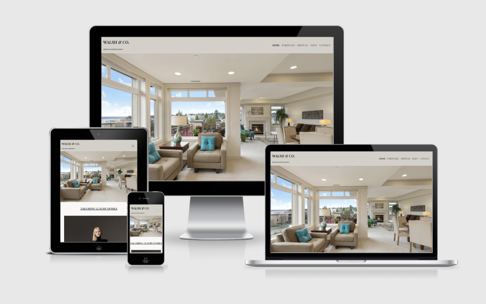

# Table of Contents
  * [Walsh and Co Original Interior Design](#walsh-and-co-original-interior-design)
  * [UX](#ux)
    * [Project Research](#project-research)
        + [Research Analysis](#research-analysis)
    * [Persona and Their Goals](#persona-and-their-goals)
    * [User Stories](#user-stories)
    * [Wireframes](#wireframes)
  * [Design](#design)
    * [Colour Scheme](#colour-scheme)
    * [Favicon](#favicon)
    * [Typography](#typography)
    * [Imagery](#imagery)
    * [Layout](#layout)
  * [Features](#features)
    * [Existing Features](#existing-features)
    * [Features to be Implemented in Future](#features-to-be-implemented-in-future)
  * [Technologies Used](#technologies-used)
    * [Languages](#languages)
    * [Frameworks & Libraries](#frameworks---libraries)
  * [Testing](#testing)
    * [User Stories Testing](#user-stories-testing)
    * [Additional Testing](#additional-testing)
        + [Ongoing Bugs](#ongoing-bugs)
  * [Deployment](#deployment)
    * [GitHub Pages](#github-pages)
    * [Forking the Published GitHub Repository](#forking-the-published-github-repository)
    * [Cloning the Published GitHub Repository](#cloning-the-published-github-repository)
  * [Credits](#credits)
    * [Imagery](#imagery-1)
    * [Code](#code)
    * [Acknowledgements](#acknowledgements)

<small><i><a href='http://ecotrust-canada.github.io/markdown-toc/'>Table of contents generated with markdown-toc</a></i></small>

# Walsh and Co Original Interior Design

I created this website for the 1st Milestone Project on User Centric Frontend, at Code Institute's Diploma in Software Development course. 

I wanted to create a website to showcase a fictional, luxury, interior design company, based in Ireland and England.  
The website features an initial landing page, and four additional pages of content.
# UX

  * ## Project Research

    I have worked in and managed a trade paint shop since 2016. Having served thousands of customers, I have a good understanding of the expectations people have when it comes to the finish of their homes. 

    * ### Research Analysis

      As people have had to spend a lot more time at home since the start of the pandemic, there has been a huge increase in home improvements.
      
      Everyone wants an 'Instaworthy' home with a high-end finish. 

  * ## Persona and Their Goals

    The ideal customer for this company is wealthy. 
    
    They are looking for luxury with no expense spared. They believe in spending on quality materials. 
    
    They want a bespoke experience, tailored to their every desire. 
    
    They want a service that is going to take them from conception to completion, by a team that they can trust.

  * ## User Stories
    1. As a user visiting the site for the first time, I want to navigate the site intuitively.
    2. As a user, I want to know what services are provided, and what is involved in the process.
    3. As a user, I want to be able to find out the cost of the services provided.
    4. As a user, I want to be able to see past projects, in order to know if this is the right company for me.
    5. As a user, I want to be able to contact the company.
    6. As a user, I want to book an appointment.
    7. As a user, I want to enquire about something that I didn't see covered on the website.
    8. As a user, I want to know where you are located.
    9. As a user, I want to be able to access your social media accounts.
    10. As a user, I want to know who I will be dealing with.
  * ## Wireframes
    * [Home](link)
    * [Portfolio](link)
    * [Services](link)
    * [Paint](link)
      * [Stockists](link)
    * [Contact](link)
      * [Form Success](link)
  * ## Design
    * ## Colour Scheme
      I wanted a neutral colour scheme that wasn't going to detract from the overall flow of the website. 
      
      I settled on my hero image very early on. I used the [Coolors](https://coolors.co/) website to generate a [colour](assets/docs/colour-palette.jpg) pallette for the website from my hero image. This meant that the colours complimented each other nicely. 
    * ## Favicon 
      I used the website : [Favicon.io](https://favicon.io/) to create a favicon for my website. I wanted to continue with the neutral theme of the so I kept the background colour the same as the header and footer sections. I used the same font for the headings and logo and left it as a simple 'W', so as not to be too busy.
    * ## Typography
      I wanted an elegant looking font to bolster the feeling of luxury throughout the site. I liked the contrast between the font for the headings which is Fairplay Display, and the font for the rest of the website.
    * ## Imagery
      All imagery was sourced from the website, [Unsplash.](https://unsplash.com/)

      The images that I chose were subtly oppulent, which fit the site well. The hero image is undistracting but decorated to a high standard which sets a good first impression for the site. I wanted all the images to be aesthetically pleasing, to convey the quality that I was aiming for.
    * ## Layout
      I decided on a multi-page website because I felt like each section deserved it's own dedicated page. I wanted the hero image to take up the entire space above the fold on the landing page, in order to make a good first impression. I opted for a larger than 'standard' footer as I feel like a more substantial footer leads to a more elegant feeling. The opaque overlay finishes it off nicely.
  * ## Features
    * ## Existing Features
      * Every page has the following features from left to right, top to bottom :
        * Logo - Family name - Elegant font. I made the decision to add the tagline "Original Interior Design" below the name as I felt like it wasn't clear from the landing page what the website was about. The logo also serves as a function to return to the homepage from all other pages.
        * Navbar - The heart of the website. This allows users to intuitively navigate the site. The current page that the user is on is highlighted as active, so that the user always knows where they are. It contains important information that a user would expect to find in the navbar. Including a 'call to action' form on the contact page.

          The navbar is designed to toggle from the hamburger navigation icon to a standard menu once the screen size goes past that of 991px wide. This is to satisfy the mobile first criteria of this project.
        * Content - Each page has details relating to the header of said page.
        * Footer - The footer contains the company name, opening days and times, contact email and phone numbers for the offices in Dublin and London, social media links, that open in a new tab and a hyperlink to the sites home page. 
        
          The muted font colour adds another subtle dimension to the footer.
      * Landing page - This page contains the hero image and a scroll prompt, on desktop only, to allow users to know that there is more content below the fold. 
      
        There is a brief description of the company and what they do. I have added a picture of the owner for a personal touch. I feel like a family run business is affiliated with a sense of trustworthiness. 
      
        I decided to add a banner below this content to address the current global pandemic, COVID-19, in order to add a sense that this is a real website. There is also a link in this banner that brings the user to the contact page in order to make an appointment as indicated.
      * Portfolio - The image carousel contains pictures of recent projects completed by the company, with some informative text below.
      * Services - This gives the user all the information they need, should they engage the services of the company. 
      
        It also contains the costs for the initial consultation. There is an image of a business lady at a computer accompanying this information.
      * Paint - I wanted to provide the user with a brief description of the paint service available. 
      
        The stockist button serves to pop open a modal which is styled with the same colour pallette and font as the rest of the site. In the modal there is a table containing contact information for each stockist in Ireland and England. This allows the user to choose their nearest stockist to get their paint from.
        Upon exiting the modal, below the "Stockist" button there are a range of paints available from the company.
      * Contact - This page contains a form for the user to do a number of things, e.g. Book and appointment, online consultation, private home enquiry, commercial enquiry or other option to be specified in the message section. There is an option to opt in, or out of signing up to the companies newsletter, along with an option to say how the user heard about the company. 
      
        The user must submit certain details on the form in order for it to be successful. Once done, the user is brought to a success page that thanks them for their enquiry. It will redirect the user to the services page , as stated, after 10 seconds. This page has the same styling and navigation menu as the other pages, should an error occur and the redirect fails. There is some text to let the user know that the enquiry has been submitted, and that someone will be in touch with them soon.

        Below the contact form, on desktop only, there are two cards that contain a photo of the London, and Dublin offices respectively, to give the user an idea of the locations.
    * ## Features to be Implemented in Future
      * 3D Room Visualiser and Furniture Shop
  * ## Technologies Used
    * ## Languages
      * HTML5
      * CSS
    * ## Frameworks & Libraries
      * Bootstrap v.5 (which uses JavaScript)
      * !bcdn5 - Eventyret
      * Google Fonts
      * Font Awesome
      * Coolors.co
      * Favicon.io
      * Unsplash
      * Balsamiq
      * VS Code
      * GitHub
      * Autoprefixer
  * ## Testing
    * ## User Stories Testing
    * ## Additional Testing
        * ### Ongoing Bugs
  * ## Deployment
    * ## GitHub Pages
    * ## Forking the Published GitHub Repository
    * ## Cloning the Published GitHub Repository
  * ## Credits
    * ## Imagery
    * ## Code
    * ## Acknowledgements

