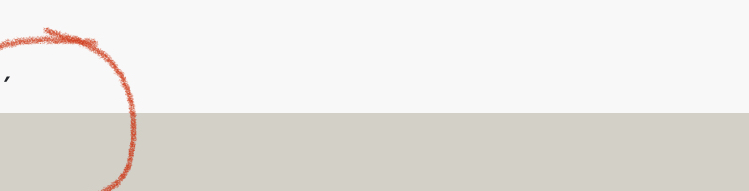
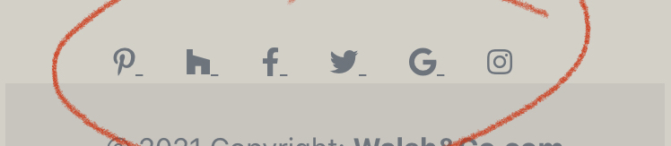
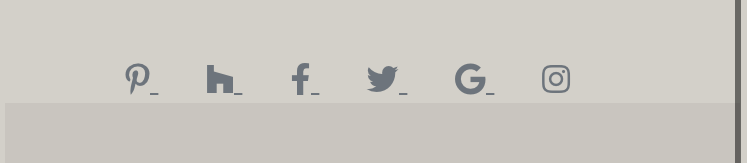

# Walsh and Co Original Interior Design

I created this website for the 1st Milestone Project on User Centric Frontend, at Code Institute's Diploma in Software Development course. 

Visit the live [website.](https://maggiewalsh.github.io/walsh_and_co/)

I wanted to create a website to showcase a fictional, luxury, interior design company, based in Ireland and England.  
The website features an initial landing page, and four additional pages of content with various different additional elements to create a website that feels real.


# Table of Contents
  * [UX and UI](#ux-and-ui)
    * [Project Research](#project-research)
        + [Research Analysis](#research-analysis)
    * [Persona and Their Goals](#persona-and-their-goals)
    * [Owner Goals](#owner-goals)
    * [User Stories](#user-stories)
    * [Wireframes](#wireframes)
  * [Design](#design)
    * [Colour Scheme](#colour-scheme)
    * [Favicon](#favicon)
    * [Typography](#typography)
    * [Imagery](#imagery)
    * [Layout](#layout)
  * [Features](#features)
    * [Existing Features](#existing-features)
    * [Features to be Implemented in Future](#features-to-be-implemented-in-future)
  * [Technologies Used](#technologies-used)
    * [Languages](#languages)
    * [Frameworks and Libraries](#frameworks-and-libraries)
  * [Testing](#testing)
    * [Manual Testing](#manual-testing)
    * [Additional Testing](#additional-testing)
    * [Resolved Bugs](#resolved-bugs)
  * [Deployment](#deployment)
    * [Forking a GitHub Repository](#forking-a-github-repository)
    * [Forking a GitHub Repository](#forking-a-github-repository)
    * [Cloning a repository using the command line](#cloning-a-repository-using-the-command-line)
  * [Credits](#credits)
    * [Imagery](#imagery)
    * [Code](#code)
    * [Acknowledgements](#acknowledgements)

<small><i><a href='http://ecotrust-canada.github.io/markdown-toc/'>Table of contents generated with markdown-toc</a></i></small>

# UX and UI

  * ## Project Research

    I have worked in, and managed a trade paint shop since 2016. Having served thousands of customers, I have a good understanding of the expectations people have when it comes to the finish of their homes. 

    * ## Research Analysis

      As people have had to spend a lot more time at home since the start of the pandemic, there has been a huge increase in home improvements.
      
      Everyone wants an 'Instaworthy' home with a high-end finish. 

  * ## Persona and Their Goals

    * The ideal customer for this company is wealthy. 
    
    * They are looking for luxury with no expense spared. They believe in spending on quality materials. 
    
    * They want a bespoke experience, tailored to their every desire. 
    
    * They want a service that is going to take them from conception to completion, by a team that they can trust.

  * ## Owner Goals
    1. Increase sales.
    2. Improve interaction with existing and potential customers.
    3. Build the brand.
  * ## User Stories
    1. As a user visiting the site for the first time, I want to navigate the site intuitively.
    2. As a user, I want to know what services are provided, and what is involved in the process.
    3. As a user, I want to be able to find out the cost of the services provided.
    4. As a user, I want to be able to see past projects, in order to know if this is the right company for me.
    5. As a user, I want to be able to contact the company.
    6. As a user, I want to know where your paint stockists are located.
    7. As a user, I want to be able to access your social media accounts.
  * ## Wireframes
    * Mobile, Tablet, and Desktop wireframes are all available [here.](docs/wireframes.pdf)
  * ## Design
    * ## Colour Scheme
      I wanted a neutral colour scheme that wasn't going to detract from the overall flow of the website. 
      
      I settled on my hero image very early on. I used the [Coolors](https://coolors.co/) website to generate a [colour](docs/colour-palette.jpg) pallette for the website from my hero image. This meant that the colours complimented each other nicely. 
    * ## Favicon 
      I used the [Favicon.io](https://favicon.io/) website to create a favicon for my website. I wanted to continue with the neutral theme, so I kept the background colour the same as the header and footer sections. I used the same font for the headings and logo and left it as a simple 'W', so as not to be too busy.
    * ## Typography
      I wanted an elegant looking font to bolster the feeling of luxury throughout the site. I liked the contrast between the font for the headings which is Fairplay Display, and the font for the rest of the website.
    * ## Imagery
      All imagery was sourced from the website, [Unsplash.](https://unsplash.com/)

      The images that I chose were subtly oppulent, which fit the site well. The hero image is undistracting but decorated to a high standard which sets a good first impression for the site. I wanted all the images to be aesthetically pleasing, to convey the quality that I was aiming for.
    * ## Layout
      I decided on a multi-page website because I felt like each section deserved it's own dedicated page. I wanted the hero image to take up the entire space above the fold on the landing page, in order to make a good first impression. I opted for a larger than 'standard' footer as I feel like a more substantial footer leads to a more elegant feeling. The opaque overlay finishes it off nicely.
  * ## Features
    * ## Existing Features
      * Every page has the following features from left to right, top to bottom :
        * Logo - Family name - Elegant font. I made the decision to add the tagline "Original Interior Design" below the name as I felt like it wasn't clear from the landing page what the website was about. The logo also serves as a function to return to the landing page from all other pages.

          

        * Navbar - The heart of the website. This allows users to intuitively navigate the site. The current page that the user is on is highlighted as active, so that the user always knows where they are. It contains important information that a user would expect to find in the navbar. Including a 'call to action' form on the contact page.

          The navbar is designed to toggle from the hamburger navigation icon to a standard menu once the screen size goes past that of 991px wide. This is to satisfy the mobile first criteria of this project.

          

        * Content - Each page has details relating to the header of said page.
        * Footer - The footer contains the company name, opening days and times, contact email and phone numbers for the offices in Dublin and London, social media links, that open in a new tab and a hyperlink to the sites home page. 

          

      * Landing page - This page contains the hero image and a scroll prompt, on desktop only, to allow users to know that there is more content below the fold. 
      
        There is a brief description of the company and what they do. I have added a picture of the owner for a personal touch. I feel like a family run business is affiliated with a sense of trustworthiness. 
      
        I decided to add a banner below this content to address the current global pandemic, COVID-19, in order to add a sense that this is a real website. There is also a link in this banner that brings the user to the contact page in order to make an appointment as indicated.

        

      * Portfolio - The image carousel contains pictures of recent projects completed by the company, with some informative text below.

        

      * Services - This gives the user all the information they need, should they engage the services of the company. 
      
        It also contains the costs for the initial consultation. There is an image of a business lady at a computer accompanying this information.

        

      * Paint - I wanted to provide the user with a brief description of the paint service available. 
      
        The stockist button serves to pop open a modal which is styled with the same colour pallette and font as the rest of the site. In the modal there is a table containing contact information for each stockist in Ireland and England. This allows the user to choose their nearest stockist to get their paint from.
        Upon exiting the modal, below the "Stockist" button there are a range of paints available from the company.

        

      * Contact - This page contains a form for the user to do a number of things, e.g. book an appointment, online consultation, private home enquiry, commercial enquiry or other option to be specified in the message section. There is an option to opt in, or out of signing up to the companies newsletter, along with an option to say how the user heard about the company. 
      
        The user must submit certain details on the form in order for it to be successful. Once done, the user is brought to a success page that thanks them for their enquiry. It will redirect the user to the services page , as stated, after 10 seconds. This page has the same styling and navigation menu as the other pages. Should an error occur and the redirect fails, the user will be able to navigate the page as normal. There is some text to let the user know that the enquiry has been submitted, and that someone will be in touch with them soon.

        Below the contact form, on desktop only, there are two cards that contain a photo of the London, and Dublin offices respectively, to give the user an idea of the company offices.

        

      * 404 Error - This page is a purpose made error page to link to the email address in the footer. There is a return to home link which directs the user back to the websites landing page.

        

    * ## Features to be Implemented in Future
      * 3D Room Visualiser - To be able to provide clients with visual representation of the projected finished look.
      * Furniture Shop - To allow clients to browse the furniture available, ahead of an appointment or to buy direct.
  * ## Technologies Used
    * ## Languages
      * [HTML5](https://en.wikipedia.org/wiki/HTML5)
      * [CSS](https://en.wikipedia.org/wiki/CSS)
    * ## Frameworks and Libraries
      * [Bootstrap v.5](https://getbootstrap.com/docs/5.0/getting-started/introduction/) (which uses JavaScript)
      * [!bcdn5](https://marketplace.visualstudio.com/items?itemName=eventyret.bootstrap-4-cdn-snippet) extension
      * [Google Fonts](https://fonts.google.com/)
      * [Font Awesome](https://fontawesome.com/)
      * [Coolors.co](https://coolors.co)
      * [Favicon.io](https://favicon.io)
      * [Unsplash](https://unsplash.com/)
      * [Balsamiq](https://balsamiq.com/)
      * [VS Code](https://code.visualstudio.com/)
      * [GitHub](https://github.com/)
      * [Autoprefixer](https://autoprefixer.github.io/)
      * [Am I Responsive](http://ami.responsivedesign.is/)
  * ## Testing
    Testing for this website was done using the Google Chrome Browser, using Chrome Developer Tools to check the different screensizes. Testing was also done on an iPhone 8 using Safari, as sometimes Safari can cause issues with how the website renders. No such errors were found.
    * ## User Stories Testing
      1. As a user visiting the site for the first time, I want to navigate the site intuitively.
         * A user can navigate to the landing page from any page in the website. Either via the navigation menu, or the logo. As is standard with most navigation these days.
         * On the landing page there is a banner providing Covid-19 information and also a link to the call to action form on the contact page.
      2. As a user, I want to know what services are provided, and what is involved in the process.
         * A user can navigate to the services page in order to see what is involved int the interior design steps.
         * There is further information regarding the paint service on the paint page.
      3. As a user, I want to be able to find out the cost of the services provided.
         * A user can find out the cost for the initial consultation by navigating to the services page.
      4. As a user, I want to be able to see past projects, in order to know if this is the right company for me.
         * A user can view past projects by navigating to the portfolio page, where there is a carousel of images of the companies most recent projects.
      5. As a user, I want to be able to contact the company.
         * A user can contact the company via the telephone numbers in the footer.
         * A user can contact the company via the email address in the footer.
         * A user can contact the company via the form on the contact page.
      6. As a user, I want to know where your paint stockists are located.
         * A user can find out the location of the paint stockists by navigating to the paint page and clicking on the stockist button, which will open a modal containing the stockist locations.
      7. As a user, I want to be able to access your social media accounts.
         * A user can access the comapnies social media links via the footer in any of the pages that they find themselves on.
    * ## Manual Testing 
      * Navigation - Repeated steps on all pages.
        * Click on logo to confirm that it navigates to landing page.
        * Click on all navigation links to verify that they direct to the indicated page.
        * Verify that the current page the user is on, is highlighted as active in the menu.
        * Verify that the navigation menu shifts to from [hamburger](docs/hamburger.png) on screens of 991px and above. 
      * Landing page
        * Verify that the [scroll](docs/no-scroll.png) prompt works only on screens 991px and above.
        * Verify that the link to make an appointment directs the user to the contact page.
      * Portfolio
        * Verify that the image carousel is functional, and clicks through the images.
        * Verify that images are confined to the carousel and not overflowing it.
      * Paint
        * Verify that the stockist button pops open a modal.
        * Verify that the modal contains a table with stockist information. 
        * Verify that modal closes when the 'X' button is selected, or the user clicks on the screen anywhere outside of the modal window.
      * Contact
        * Verify that all elements that are set to required are working.
        * Verify that valid email address is needed with relevant '@' included.
        * Verify that 'Submit' button directs user to a success page.
      * Form success
        * Verify that navigation elements work the same as all other pages.
        * Verify that the page automatically redirects the user to the services page after 10 seconds, as indicated.
      * Footer - Repeated steps on all pages.
        * Verify that the social media links open in a new tab.
        * Verify that the email link directs the user to a custom 404 error page when selected.
        * Verify that the 404 error page 'Return home' link brings the user back to the landing page.
        * Verify that the phone number shown is dialled when selected.
        * Verify that the website hyperlink directs the user back to the landing page.
    * ## Additional Testing 
      * [W3 - Jigsaw Validator](https://jigsaw.w3.org/css-validator/)

      * [W3C - HTML Validator](https://validator.w3.org/)
    * ## Resolved Bugs
      * On the Contact page there was a modal pop up to confirm the contact form worked. I changed this to a custom success page, but I forgot to remove the header classes so the browser was looking for a modal unnecessarily. Which resulted in the following error. I resolved it by deleting the unnecessary modal elements.

        

      * I noticed stray ```, _``` in some places on my code. I eventually figured out that it was because of whitespace in my code. Which resolved once I deleted it.

        

        

      * In the footer the links were the blue, it didn't suit the style of the rest of the website so I targeted the links in my css in order to change them to a more pleasing colour. 

        The contrast between the footer color and the font was poor, I removed the muted text class to revert it to it's darker color.

        

      * Initially the landing page didn't have the tagline 'Original Interior Design' I felt like it wasn't immediately clear what the purpose of the website was. I chose to add this tagline in order to make it clear.

      * As the hero image takes up the entire content above the fold, I was worried that users to the site might not realise that there was more content upon scrolling. This led to me looking for a scroll indicator that I could apply to the desktop version. I found that on another CI students page, Fiachra Holland, who I have credited in my code and further down the readme.

      * In order to improve accessibility, I added *aria labels* to all non-text links.

      * In order to improve accessibility, I added *aria-hidden true* to Font Awesome icons that were not fucntional.

      * In order to improve best practices, I added *rel-noopener* to the untrusted external links.

  * ## Deployment

     I chose to create this project in VS Code rather than Gitpod. This is why there is no instructions related to Gitpod.
  
      1. On GitHub, navigate to your site's repository.
      2. Under your repository name, click  *Settings*.
      3. In the left sidebar, click Pages.
      Page tab in the left-hand sidebar
      4. Under "GitHub Pages", use the *None* or *Branch* drop-down menu and select a publishing source.
      5. Optionally, use the drop-down menu to select a folder for your publishing source.
      6. Click Save.

  * ## Forking a GitHub Repository
      1. Login to GitHub.
      2. Locate your desired repository.
      3. Locate the fork option in the top-right hand corner of the repository page.    
      4. You will be asked where you want to fork it to.

  * ## Cloning a repository using the command line
      1. On GitHub, navigate to the main page of the repository.
      2. Above the list of files, click download code.
      3. To clone the repository using HTTPS, under "Clone with HTTPS", click clipboard icon. To clone the repository using an SSH key, including a certificate issued by your organization's SSH certificate authority, click *Use SSH*, then click clipboard icon. To clone a repository using GitHub CLI, click Use *GitHub CLI*, then click clipboard icon.
      4. Open Terminal.
      5. Change the current working directory to the location where you want the cloned directory.
      6. Type ```git clone```, and then paste the URL you copied earlier.

           ```
           $ git clone https://github.com/YOUR-USERNAME/YOUR-REPOSITORY
           ```

      7. Press Enter to create your local clone.

          ```
          $ git clone https://github.com/YOUR-USERNAME/YOUR-REPOSITORY
          ```

        \> Cloning into \`Spoon-Knife`\...

        \> remote: Counting objects: 10, done.

        \> remote: Compressing objects: 100% (8/8), done.

        \> remove: Total 10 (delta 1), reused 10 (delta 1)

        \> Unpacking objects: 100% (10/10), done.

  * ## Credits
    * ## Imagery
        * [Unsplash](https://unsplash.com)
    * ## Code
      * Bootstrap was the base for the entire website in order to ensure it's responsivity.
      * All code is my own unless explicitly stated in my code files in a comment.
      * A special mention to Fiachra Holland for the code for the scroll indicator and the redirect function as mentioned in the comments in my code. Also for the basic structure for the README.md file.
      * Credit to [MDB](https://mdbootstrap.com/) for the footer that I adapted.
      * Credit to Stack Overflow for some solutions that I have commented in my code.
    * ## Acknowledgements
      * A special thank you to my mentor Rohit Sharma.  
      * Thanks to my peers on Slack, specifically those that responded in the peer review, and my mini feb team, for their support along the way.


